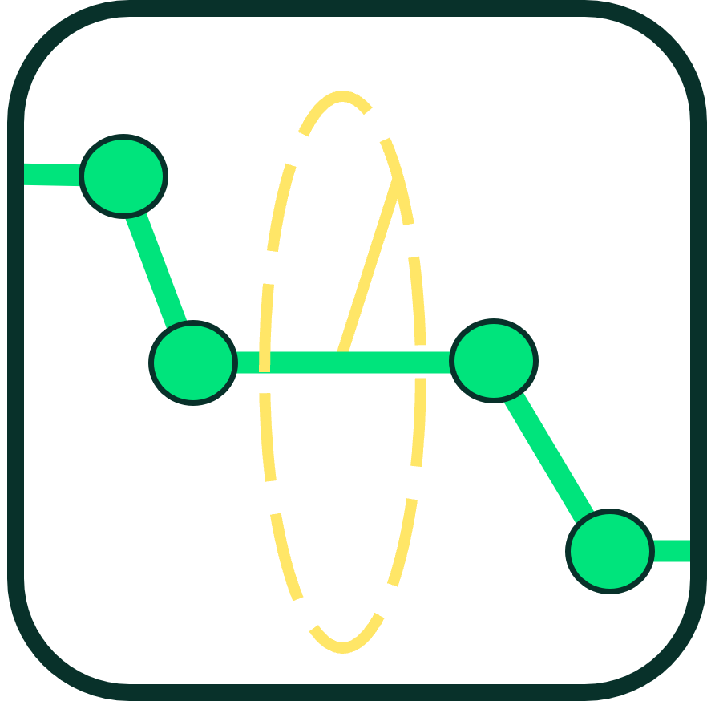
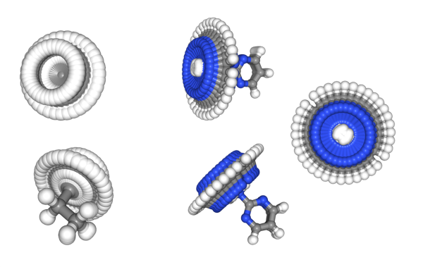
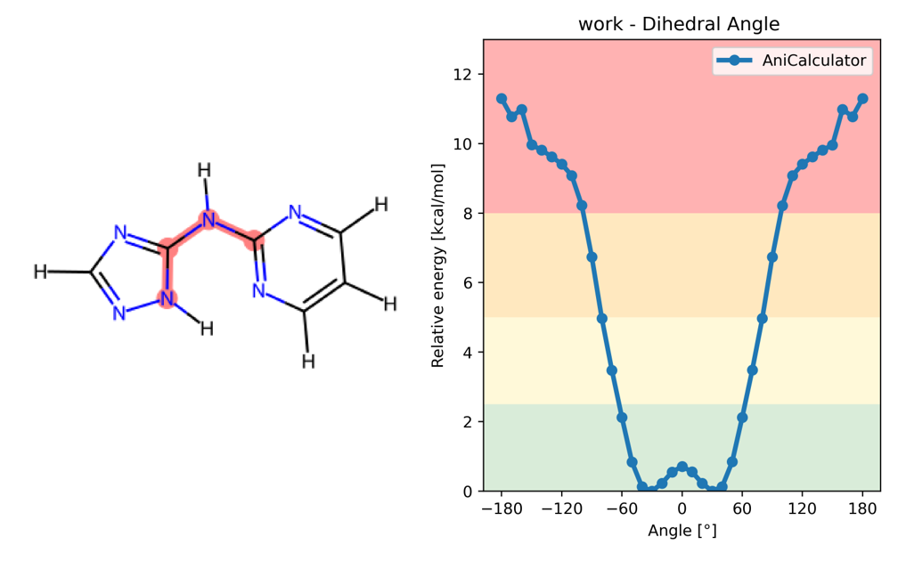

<p align="center">
    <picture align="center">
      <source media="(prefers-color-scheme: dark)" srcset=".img/torsion_profiler_logo_dark.png">
      <source media="(prefers-color-scheme: light)" srcset=".img/torsion_profiler_logo.png">
      
    </picture>
</p>

# TorsionProfiler
Torsion Profiler is a package for calculating and analyzing torsion profiles. It offers the capability to compute a torsion profile across various theoretical layers, ranging from Density Functional Theory in Quantum Mechanics, machine-learned neural network potentials to classical force field methods from the realm of Molecular Mechanics. Additionally, the package includes features for analyzing and comparing torsion profiles.

A key strength of TorsionProfiler lies in its modularity, which facilitates the easy swapping of theoretical levels or methods in the calculation. It also scales seamlessly from a single interactively calculated torsion profile to hundreds in High-Performance Computing (HPC) environments.
At the heart of TorsionProfiler is the TorsionProfiler class, which standardizes the process of calculating torsion profiles. This general approach can be divided into two main steps:

• The initial step involves the rapid generation of a torsion profile, creating an initial torsion profile via an initial_torsion_profile_generator. The objective here is to establish a set of coordinates as an initial starting point (for example, 36 starting molecule conformations forming the 360-degree rotation).
	   

• The subsequent step involves optimizing each generated conformation that represents one torsion angle at the desired theoretical level. The backends currently implemented include MMFF94, OpenFF 2.0, OpenFF-Mace2023, ANI, XTB, Gaussian, and Psi4. This step produces the final torsion profile coordinates and energies.
	   

TorsionProfiler can be utilized either through Python3 or as a Command-Line Interface (CLI) tool (details provided below).

Chckout our publication: [Beyond Barriers, Big Crystallisation Hurdles: Atropisomerism in bRo5 Compounds Explored by Computational and NMR Studies](https://doi.org/10.1021/acs.molpharmaceut.5c00204)


## Usage
There are multiple ways how you can get a torsion profile, either you use the command line tool in bash or you access our code via python:

### CLI
TorsionProfiler has an CLI tool:
```shell
> conda activate torsion_profiler
> torsion_profiler_cli -h
Usage: torsion_profiler_cli [OPTIONS] COMMAND [ARGS]...

  This is the command line tool to provide easy access to functionality from
  the Torsion Profiler Python library.

Options:
  --version   Show the version and exit.
  --log PATH  logging configuration file
  -h, --help  Show this message and exit.

TorsionProfiles Commands:
  tp-ani   Run a torsionProfile with ani
  tp-g16   Run a torsionProfile with gaussian 16 wB97XD
  tp-off   Run a torsionProfile with OFF2
  tp-psi4  Run a torsionProfile with Psi4 wB97XD
  tp-xtb   Run a torsionProfile with XTB with GFN2-xTB

```

* **CLI - Calculate a single Torsion**
```shell
#!/usr/bin/env bash
conda activate torsion_profiler

torsion_profiler_cli tp-off -m c1ccccc1NCC -t 6,7,8,9 # -m can also be a path to an .sdf-file
```

* **CLI - Calculate all torsions of a molecule**
```shell
#!/usr/bin/env bash
conda activate torsion_profiler

torsion_profiler_cli tp-off -m c1ccccc1NCC -a true
```

### PYTHON
* **PYTHON - Calculate a single Torsion**
Of course you can access TorsionProfiler over python, just make sure you activated the correct env (see developer info)
```python

# input Test data - sdfs
from torsion_profiler.data.torsionProfiles import ToyTestSet

mols = ToyTestSet.get_mols()
mol = mols[0]
torsion_atom_ids = (0, 1, 2, 3)

# Setup machinery
from torsion_profiler.tools.torsion_profiler import TorsionProfiler
from torsion_profiler.engines import AniCalculator

n_measurements = 37
aniCal = AniCalculator()
tp = TorsionProfiler(calculator=aniCal,
                     n_measurements=n_measurements)

# Calculate
df = tp.calculateTorsion_profile(mol=mol,
                                 torsion_atom_ids=torsion_atom_ids)

# Visualize
from torsion_profiler.visualize import plot_torsion_profile

plot_torsion_profile(mol=mol, torsion_atom_ids=torsion_atom_ids,
                     x=df.angles, y=df.rel_potential_energies,
                     data_labels="ANI2x", title_prefix=str(torsion_atom_ids));
```

* **PYTHON - Calculate multiple torsions for multiple molecules**
```python
#Load Data:
import ast
from torsion_profiler.data.torsion_profiles import RowleyBiarylSet
mols = RowleyBiarylSet.get_mols()
torsion_lists = [ast.literal_eval(mol.GetProp("torsion_atom_ids")) for mol in mols]


# Run Multiple mols at once
from torsion_profiler import conf as conda_conf
from torsion_profiler import TorsionProfiler
from torsion_profiler.engines import MACECalculator
from torsion_profiler.orchestration.submission_systems import Local, Slurm


# Setup machinery
## Calculation method
calculator=MACECalculator(optimize_structure=True)
submission_sys = Slurm(conda_env_path=conda_conf["conda_calculator_envs"][MACECalculator.__name__])

## Cluster Orchestration:


## glueing together & further options
out_folder ="./BiAryl_mace"
out_prefix = "test"

n_measurements = 37
n_processes = 6 # For parallelizing the setup
tp = TorsionProfiler(calculator=calculator,
                      n_measurements=n_measurements,
                      n_processes=n_processes,
                      submission_system=submission_sys)


job_status = tp.calculate_torsions_iter_mols(mols=mols, torsions=torsion_lists,
                                         out_dir=out_folder, approach_name=out_prefix)
df = tp.wait() # This might take some time.

```


## For Developers:
### Install
You can simply install TorsionProfiler with mamba using:
```shell
    git clone <path>
    cd torsion_profiler
    mamba env create -f environment.yml
    mamba activate torsion_profiler
    # change the config file in src/torsion_profiler/conf.json
    # to point to the correct enviroments
    pip install .
```

### Contribute
You want to contribute? Awesome :) 
there are only a few things, that I would like to have in this repo:
 1. Please use NumpyDoc Docstrings to document your code!
 2. Please use typing for function parameters, returns and class attributes
 3. Please start a branch with git of the main repo, where you develop your cool new feature :)

### Authors:
Benjamin Ries, Igor Gordiy, Markus Hermann & Thomas Fox
